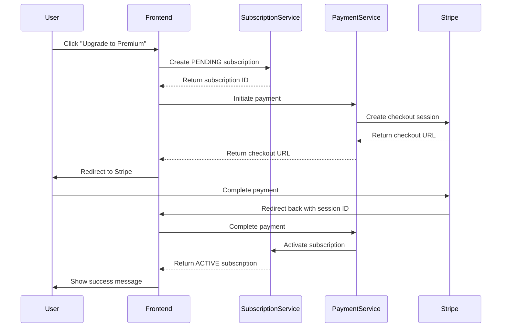

# 📱 Notification, Payment & Subscription Integration Guide

## 📋 Overview

This document provides a comprehensive guide for integrating the **Notification**, **Payment**, and **Subscription** features from the backend services into the frontend application.

**Date:** December 27, 2025  
**Author:** DEVision Team  
**Status:** ✅ Completed

---

## 🏗️ Architecture

### Backend Services

| Service | Port | Database | Purpose |
|---------|------|----------|---------|
| **Subscription Service** | 8083 | MongoDB (27020) | Manage company subscriptions and plans |
| **Payment Service** | 8084 | MongoDB (27021) | Handle Stripe payments and transactions |
| **Notification Service** | 8085 | MongoDB (27021) | Send and manage notifications |

### Frontend Integration Structure

```
Frontend/src/
├── modules/
│   ├── dashboard/
│   │   ├── hooks/
│   │   │   └── useSubscription.js          # Subscription hook
│   │   └── services/
│   │       └── subscriptionService.js      # Subscription API calls
│   ├── payment/
│   │   ├── hooks/
│   │   │   └── usePayment.js               # Payment hook
│   │   └── services/
│   │       └── paymentService.js           # Payment API calls
│   └── notification/
│       ├── hooks/
│       │   └── useNotifications.js         # Notification hook
│       └── services/
│           └── notificationService.js      # Notification API calls
├── config/
│   ├── api.js                              # API endpoints
│   └── env.js                              # Environment variables
└── utils/
    └── HttpUtil.js                         # HTTP client with interceptors
```

---

## 🔧 Configuration

### 1. Environment Variables

Update your `.env` file with the service URLs:

```env
# Backend Service URLs
VITE_API_BASE_URL=http://localhost:8080
VITE_AUTH_SERVICE_URL=http://localhost:8080
VITE_COMPANY_SERVICE_URL=http://localhost:8082
VITE_SUBSCRIPTION_SERVICE_URL=http://localhost:8083
VITE_PAYMENT_SERVICE_URL=http://localhost:8084
VITE_NOTIFICATION_SERVICE_URL=http://localhost:8085
```

### 2. Service Configuration

The services are configured in `src/config/env.js`:

```javascript
export const ENV = {
  SUBSCRIPTION_SERVICE_URL: import.meta.env.VITE_SUBSCRIPTION_SERVICE_URL || "http://localhost:8083",
  PAYMENT_SERVICE_URL: import.meta.env.VITE_PAYMENT_SERVICE_URL || "http://localhost:8084",
  NOTIFICATION_SERVICE_URL: import.meta.env.VITE_NOTIFICATION_SERVICE_URL || "http://localhost:8085",
  // ... other configs
};
```

---

## 📦 Services

### Subscription Service

**File:** `src/modules/dashboard/services/subscriptionService.js`

#### Methods

```javascript
// Create a new subscription
createSubscription(subscriptionData)

// Get subscription by company ID
getSubscriptionByCompanyId(companyId)

// Get subscription by ID
getSubscriptionById(subscriptionId)

// Activate subscription with payment
activateSubscription(subscriptionId, paymentId)

// Cancel subscription
cancelSubscription(subscriptionId)

// Check expired subscriptions (admin)
checkExpiredSubscriptions()
```

#### Usage Example

```javascript
import { createSubscription } from '../services/subscriptionService';

const subscriptionData = {
  companyId: "company123",
  planType: "PREMIUM",
  billingEmail: "billing@company.com"
};

const subscription = await createSubscription(subscriptionData);
// Returns: { subscriptionId, companyId, planType, status, ... }
```

---

### Payment Service

**File:** `src/modules/payment/services/paymentService.js`

#### Methods

```javascript
// Initiate a payment (creates Stripe checkout session)
initiatePayment(paymentData)

// Complete payment after Stripe redirect
completePayment(sessionId)

// Get payment by transaction ID
getPaymentById(transactionId)

// Get customer payment history
getCustomerPayments(customerId)

// Cancel payment
cancelPayment(sessionId)
```

#### Usage Example

```javascript
import { initiatePayment } from '../services/paymentService';

const paymentData = {
  subsystem: "JOB_MANAGER",
  paymentType: "SUBSCRIPTION",
  customerId: "company123",
  email: "billing@company.com",
  referenceId: "subscription123",
  amount: 3000, // $30.00 in cents
  currency: "USD",
  gateway: "STRIPE",
  description: "Premium Subscription - 1 Month"
};

const response = await initiatePayment(paymentData);
// Redirects to: response.checkoutUrl
```

---

### Notification Service

**File:** `src/modules/notification/services/notificationService.js`

#### Methods

```javascript
// Get notifications for a company
getNotifications(companyId)

// Mark notification as read
markAsRead(notificationId)

// Delete notification
deleteNotification(notificationId)

// Get unread count
getUnreadCount(companyId)
```

#### Usage Example

```javascript
import { getNotifications } from '../services/notificationService';

const notifications = await getNotifications("company123");
// Returns: [{ id, companyId, subject, message, read, createdAt, ... }]
```

---

## 🪝 React Hooks

### useSubscription Hook

**File:** `src/modules/dashboard/hooks/useSubscription.js`

#### API

```javascript
const {
  subscription,      // Current subscription object
  loading,          // Loading state
  error,            // Error message
  create,           // Create subscription
  getById,          // Get by ID
  activate,         // Activate subscription
  cancel,           // Cancel subscription
  refetch,          // Refetch subscription
  isActive,         // Check if active
  isPending,        // Check if pending
  getDaysRemaining  // Days until expiry
} = useSubscription(companyId);
```

#### Usage Example

```javascript
import { useSubscription } from '../hooks/useSubscription';

function SubscriptionStatus() {
  const { subscription, loading, isActive, getDaysRemaining } = useSubscription(companyId);

  if (loading) return <div>Loading...</div>;

  return (
    <div>
      <p>Status: {subscription?.status}</p>
      <p>Plan: {subscription?.planType}</p>
      <p>Days Remaining: {getDaysRemaining()}</p>
      {isActive() && <span>✅ Active</span>}
    </div>
  );
}
```

---

### usePayment Hook

**File:** `src/modules/payment/hooks/usePayment.js`

#### API

```javascript
const {
  loading,         // Loading state
  error,           // Error message
  paymentHistory,  // Payment history array
  initiate,        // Initiate payment
  complete,        // Complete payment
  getById,         // Get payment by ID
  getHistory,      // Get payment history
  cancel           // Cancel payment
} = usePayment();
```

#### Usage Example

```javascript
import { usePayment } from '../hooks/usePayment';

function UpgradeButton() {
  const { initiate, loading } = usePayment();

  const handleUpgrade = async () => {
    try {
      await initiate({
        subsystem: "JOB_MANAGER",
        paymentType: "SUBSCRIPTION",
        customerId: companyId,
        email: userEmail,
        referenceId: subscriptionId,
        amount: 3000,
        currency: "USD",
        gateway: "STRIPE",
        description: "Premium Plan Upgrade"
      });
      // User will be redirected to Stripe checkout
    } catch (error) {
      console.error('Payment failed:', error);
    }
  };

  return (
    <button onClick={handleUpgrade} disabled={loading}>
      {loading ? 'Processing...' : 'Upgrade to Premium'}
    </button>
  );
}
```

---

### useNotifications Hook

**File:** `src/modules/notification/hooks/useNotifications.js`

#### API

```javascript
const {
  notifications,         // Notifications array
  unreadCount,          // Unread count
  loading,              // Loading state
  error,                // Error message
  refetch,              // Refetch notifications
  markAsRead,           // Mark as read
  deleteNotification,   // Delete notification
  refreshUnreadCount    // Refresh unread count
} = useNotifications(companyId, pollInterval);
```

#### Usage Example

```javascript
import { useNotifications } from '../hooks/useNotifications';

function NotificationBell() {
  const { notifications, unreadCount, markAsRead } = useNotifications(companyId, 30000);

  return (
    <div>
      <span>🔔 {unreadCount > 0 && `(${unreadCount})`}</span>
      <div className="notifications">
        {notifications.map(notif => (
          <div key={notif.id} onClick={() => markAsRead(notif.id)}>
            {notif.subject}
          </div>
        ))}
      </div>
    </div>
  );
}
```

---

## 🔄 Complete Integration Flow

### Subscription Upgrade Flow



### Implementation Steps

#### 1. Create Subscription

```javascript
const { create } = useSubscription(companyId);

const subscription = await create({
  companyId: companyId,
  planType: "PREMIUM",
  billingEmail: userEmail
});

console.log('Subscription created:', subscription.subscriptionId);
// Status: PENDING
```

#### 2. Initiate Payment

```javascript
const { initiate } = usePayment();

await initiate({
  subsystem: "JOB_MANAGER",
  paymentType: "SUBSCRIPTION",
  customerId: companyId,
  email: userEmail,
  referenceId: subscription.subscriptionId,
  amount: 3000, // $30.00
  currency: "USD",
  gateway: "STRIPE",
  description: "Premium Subscription - 1 Month"
});

// User is redirected to Stripe checkout page
```

#### 3. Handle Stripe Success Redirect

Create a payment success page: `src/pages/PaymentSuccess.jsx`

```javascript
import { useEffect } from 'react';
import { useSearchParams } from 'react-router-dom';
import { usePayment } from '../modules/payment/hooks/usePayment';

function PaymentSuccess() {
  const [searchParams] = useSearchParams();
  const { complete } = usePayment();
  const sessionId = searchParams.get('session_id');

  useEffect(() => {
    if (sessionId) {
      completePaymentFlow();
    }
  }, [sessionId]);

  const completePaymentFlow = async () => {
    try {
      const payment = await complete(sessionId);
      console.log('Payment completed:', payment);
      // Subscription is now ACTIVE
    } catch (error) {
      console.error('Payment completion failed:', error);
    }
  };

  return <div>Processing payment...</div>;
}
```

#### 4. Update Router

Add routes in your router configuration:

```javascript
import PaymentSuccess from './pages/PaymentSuccess';
import PaymentCancel from './pages/PaymentCancel';

const routes = [
  // ... existing routes
  { path: '/payment/success', element: <PaymentSuccess /> },
  { path: '/payment/cancel', element: <PaymentCancel /> },
];
```

---

## 🧪 Testing

### Test Subscription Creation

```javascript
// In browser console or test file
import { createSubscription } from './services/subscriptionService';

const result = await createSubscription({
  companyId: "test-company-123",
  planType: "PREMIUM",
  billingEmail: "test@example.com"
});

console.log('Created subscription:', result);
```

### Test Payment Initiation

```javascript
import { initiatePayment } from './services/paymentService';

const result = await initiatePayment({
  subsystem: "JOB_MANAGER",
  paymentType: "SUBSCRIPTION",
  customerId: "test-company-123",
  email: "test@example.com",
  referenceId: "sub-123",
  amount: 3000,
  currency: "USD",
  gateway: "STRIPE",
  description: "Test Payment"
});

console.log('Checkout URL:', result.checkoutUrl);
```

### Test Notifications

```javascript
import { getNotifications } from './services/notificationService';

const notifications = await getNotifications("test-company-123");
console.log('Notifications:', notifications);
```

---

## 🚨 Error Handling

### Common Errors

#### 401 Unauthorized
```javascript
// Automatic handling in HttpUtil.js interceptor
// User will be logged out and redirected to login
```

#### 404 Subscription Not Found
```javascript
const { subscription, error } = useSubscription(companyId);

if (!subscription && !error) {
  // No subscription exists - show upgrade options
}
```

#### Payment Failed
```javascript
const { initiate, error } = usePayment();

try {
  await initiate(paymentData);
} catch (err) {
  if (error.includes('Invalid card')) {
    // Show card error message
  } else if (error.includes('Insufficient funds')) {
    // Show insufficient funds message
  }
}
```

---

## 📊 Data Models

### Subscription Response

```typescript
{
  subscriptionId: string;
  companyId: string;
  planType: "BASIC" | "PREMIUM" | "ENTERPRISE";
  priceAmount: number;
  currency: string;
  startDate: string;
  expiryDate: string;
  status: "PENDING" | "ACTIVE" | "EXPIRED" | "CANCELLED";
  lastPaymentId: string;
  autoRenew: boolean;
  createdAt: string;
  updatedAt: string;
}
```

### Payment Response

```typescript
{
  transactionId: string;
  subsystem: "JOB_MANAGER" | "JOB_APPLICANT";
  paymentType: "SUBSCRIPTION" | "PREMIUM_FEATURE" | "ONE_TIME";
  customerId: string;
  referenceId: string;
  amount: number;
  currency: string;
  gateway: "STRIPE" | "PAYPAL";
  status: "PENDING" | "SUCCESS" | "FAILED" | "REFUNDED" | "CANCELLED";
  timestamp: string;
  description: string;
  createdAt: string;
  updatedAt: string;
}
```

### Notification Model

```typescript
{
  id: string;
  companyId: string;
  applicantId: string;
  applicantName: string;
  subject: string;
  message: string;
  read: boolean;
  createdAt: string;
}
```

---

## 🔐 Security

### JWT Authentication

All API calls require JWT authentication:

```javascript
// Automatically handled by HttpUtil.js
httpClient.interceptors.request.use((config) => {
  const token = getToken();
  if (token) {
    config.headers.Authorization = `Bearer ${token}`;
  }
  return config;
});
```

### Stripe Payment Security

- ✅ PCI-compliant (Stripe handles card data)
- ✅ Webhook verification (backend)
- ✅ Session-based checkout (no card data in frontend)
- ✅ Server-side payment verification

---

## 📝 Best Practices

### 1. Always Check Subscription Status

```javascript
const { subscription, isActive } = useSubscription(companyId);

if (!isActive()) {
  // Show upgrade prompt
  return <UpgradePrompt />;
}

// Show premium features
return <PremiumContent />;
```

### 2. Handle Payment Redirects

```javascript
// Store current page before payment
sessionStorage.setItem('returnUrl', window.location.pathname);

// After payment success, redirect back
const returnUrl = sessionStorage.getItem('returnUrl') || '/dashboard';
navigate(returnUrl);
```

### 3. Poll for Notifications

```javascript
// Use polling for real-time updates
const { notifications } = useNotifications(companyId, 30000); // Poll every 30s
```

### 4. Show Loading States

```javascript
const { loading, subscription } = useSubscription(companyId);

if (loading) {
  return <Spinner />;
}

return <SubscriptionDetails subscription={subscription} />;
```

---

## 🐛 Troubleshooting

### Services Not Responding

1. Check if backend services are running:
```bash
# PowerShell
cd Backend
.\start-all-services.ps1
```

2. Verify service ports:
- Subscription: http://localhost:8083
- Payment: http://localhost:8084
- Notification: http://localhost:8085

### CORS Issues

Ensure backend services have CORS enabled for `http://localhost:5173` (or your frontend port)

### Payment Redirect Not Working

1. Check Stripe webhook secret in backend
2. Verify success/cancel URLs match frontend routes
3. Check browser console for errors

---

## 📚 Additional Resources

- [Backend Payment Testing Guide](../../../Backend/payment/TESTING.md)
- [Backend Payment README](../../../Backend/payment/README.md)
- [Stripe Checkout Documentation](https://stripe.com/docs/payments/checkout)
- [Frontend Integration Checklist](./INTEGRATION_CHECKLIST.md)

---

## ✅ Integration Checklist

- [x] Environment variables configured
- [x] Service files created (subscriptionService, paymentService, notificationService)
- [x] Custom hooks created (useSubscription, usePayment, useNotifications)
- [x] API endpoints configured
- [x] HTTP client configured with interceptors
- [x] Error handling implemented
- [x] Payment success/cancel pages created
- [x] Router updated with payment routes
- [x] Documentation completed

---

**Last Updated:** December 27, 2025  
**Version:** 1.0.0  
**Team:** DEVision

